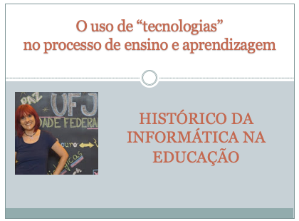

# Aula 01 e 02 - O uso de "tecnologias" no processo de ensino e aprendizagem
## Tema aula - Histórico da Informática na Educação
 
>  * Apresentação da Disciplina e plano de ensino / Histórico da Informática na Educação

## Atividades da aula - Apresentação plano de ensino, Breve resgate histórico da informática na educação

## Instalação da Disciplina

### Materiais
- [Plano de Ensino](plano_ensino_tecnologia.pdf)
- [Slides aula 01](historico.pdf)
- [Site programação logo](https://turtleacademy.com/)

### Video aulas  -  Histórico da Informática na Educação0

### Desenvolvimento aula 01 - teórica: 

- [ ]  Apresentação Plano de ensino
- [ ]  Apresentação GitHub
- [ ]  Breve resgate histórico sobre informática na educação

### Desenvolvimento aula 02 - prática: 
- [ ]  Apresentação linguagem Logo
- [ ]  Exercício Logo
