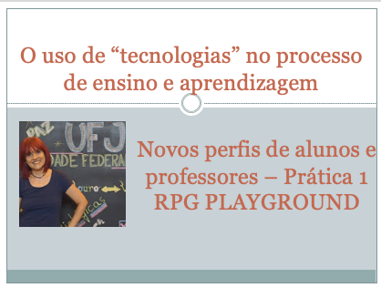

# O uso de "tecnologias" no processo de ensino e aprendizagem
## Tema aula - Os novos perfis de alunos e professores
 
>  * Quem são esses novos alunos e professores?

## Atividades da aula - Apresentação plano de ensino, Breve resgate histórico da informática na educação

## Instalação da Disciplina

### Materiais
- [Slides aula](novos_perfis.pdf)
- [Site aula prática](https://rpgplayground.com)

### Video aula  -  Os novos perfis de alunos e professores

### Desenvolvimento aula 01 - teórica: 

- [ ]  Quem é este alunos e quem são os professores?
- [ ]  As diferentes gerações (Baby Boomers, Geração X, Geração Y, Geração Z)
- [ ]  Competências do professor moderno
- [ ]  Perfil do professor moderno (comunicação,colaboração, criatividade, Senso Crítico)

### Desenvolvimento aula 02 - prática: 
- [ ]  Ferramenta que auxilia no desenvolvikmento da criatividade
- [ ]  RPG
- [ ]  Jogos de RPG famosos
- [ ]  [Prática com rpg playground](https://rpgplayground.com)
