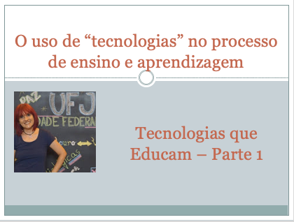
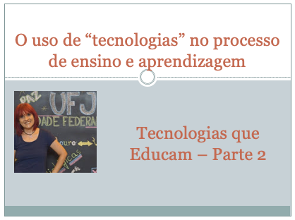

# O uso de "tecnologias" no processo de ensino e aprendizagem
## Tema aula - Tecnologias que Educam
 
>  * O que são tecnologias? Exemplos de tecnologias e suas aplicações.

## Atividades da aula - O que são tecnologias? Práticas de navegações com navegadores, só que não por oceanos e sim navegadores

### Materiais
- [Slides aula - Tecnologias que Educam - Parte 1](tecnologias_parte1.pdf)
- [Slides aula - Tecnologias que Educam - Parte 2](tecnologias_parte2.pdf)

## Tecnolgias aula prática
- [ZOTERO](https://www.zotero.org/download//)
- [MENDELEY](https://www.mendeley.com/?interaction_required=true) 
- [Google Acadêmico](https://scholar.google.com.br/?hl=pt)
- [Periódicos Capes](https://www-periodicos-capes-gov-br.ezl.periodicos.capes.gov.br/index.php?)
- [PollEverywhere](https://www.polleverywhere.com/)

### Video aulas  -  Tecnologias que educam

### Desenvolvimento aula 01 - teórica: 

- [ ]  O que é tecnologia?
- [ ]  Período de práticas de navegações, inclusive com navegadores
- [ ]  Livros e biblioteca - aprender é o processo predominante
- [ ]  Quadros, projetores - práticas de informação e o processo ensinar
- [ ]  Laboratórios, Jogos e Simuladores - Maior imersão, interação e engajamento.
- [ ]  Apresentação NAVEGADOR - informação, ensinar, comunicação, aprender
- [ ]  Exemplo de busca no Google acadêmico para demonstrar a prática de APRENDER COM INFORMAÇÃO - Como organizar? Como melhor sistematizar?

### Desenvolvimento aula 02 - prática: 
- [ ]  Como realizar buscas de forma a encontrar as informações necessárias
- [ ]  Busca avançada no Google Acadêmico
- [ ]  [Uso do ZOTERO](https://www.zotero.org/download//)
- [ ]  [Uso do MENDELEY](https://www.mendeley.com/?interaction_required=true)

### Desenvolvimento aula 03 - teórica: 

- [ ]  Continuando o uso do navegador, o que seria aprender com COMUNICAÇÃO?
- [ ]  Tecnologias que auxiliam: Whatsapp, Messenger e Facebook, Instagram, TikTok,Fóruns, GoogleClassroom, Microsoft Teams, Streamyard, Twitter
- [ ]  Questionários em tempo real: Poll Everywher
- [ ]  Exemplo Poll: Escolha meio de comunicação com a turma
- [ ]  Exemplo Poll: Qual geração vocês fazem parte?
- [ ]  O uso do navegador informação e comunicação COM ensinar.
- [ ]  Construção conteúdo colaborativo: Wikipédia, Site Colaborativo
- [ ]  Competências do professor moderno
- [ ]  Perfil do professor moderno (comunicação,colaboração, criatividade, Senso Crítico)

### Desenvolvimento aula 04 - prática: 
- [ ]  [Utilização do Poll Everywhere](https://www.polleverywhere.com/)
