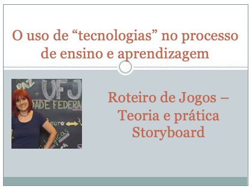

# O uso de "tecnologias" no processo de ensino e aprendizagem
## Tema aula - Roteiro de Jogos
 
>  * Explicar a importância do planejamento dos jogos educacionais

## Atividades da aula - Principais conceitos envolvidos no desenvovimento de roteiros de jogos educacionais (imersão, ação, transformação) 

### Materiais
- [Slides aula - Roteiros Jogos Educacionais ](roteiro.pdf)

## Tecnolgias aula prática
- [CANVA](https://www.canva.com/pt_br/login/?shouldClearGotAutoSelect)

### Video aula  -  Roteiro Jogos Educacionais - Teoria e Prática

### Desenvolvimento aula teórica: 

- [ ]  O que é tecnologia?

### Desenvolvimento aula  - prática: 
- [ ]  Como realizar buscas de forma a encontrar as informações necessárias
