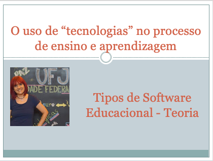
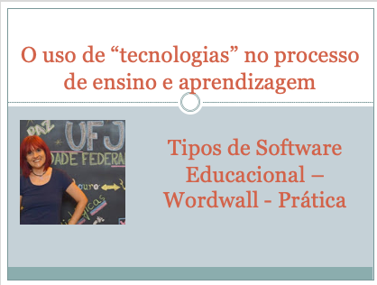

# O uso de "tecnologias" no processo de ensino e aprendizagem
## Tema aula - Os tipos de Software Educacional
 
>  * Apresentar as principais definições de Software educacional e os tipos existentes.

## Atividades da aula - Principais definicições de Software educacional, apresentar os tipos de sw educacional e para cada tipo apresentar exemplo.

### Materiais
- [Slides aula - Tipos Software Educacional](tipos_sw_educacional.pdf)

#### Exemplos tipos de software
- [Softwares tutoriais](https://www.tabelaperiodicacompleta.com/)
- [Programação](https://turtleacademy.com)
- [Exercícios e Práticas](https://pt.duolingo.com/learn)
- [Aplicativos](https://docs.google.com/document/u/0/?tgif=d)
- [Multimídia e Internet - MOOC](https://www.coursera.org/)
- [Simulação e modelagem](https://phet.colorado.edu/sims/html/concentration/latest/concentration_pt_BR.html)
- [Jogos educacionais](https://www.minecraft.net/pt-br)
- [Objetos de Aprendizagem](http://www.loa.sead.ufscar.br/)

## Tecnologia aula prática
- [Wordwall](https://wordwall.net/)

### Video aulas  -  Tipos de Software Educacional - Teoria e Prática

### Desenvolvimento aula teórica: 

- [ ]  Jogos educacionais como jogos sérios
- [ ]  Narrativa como interativas: IMERSÃO, AÇÃO e TRANSFORMAÇÃO
- [ ]  Desenvolvimento do roteiro:
- [ ]  Definir a ideia do jogo (conteúdo, narrativa e jogadores); Definir os objetivos educacionais ; Definir os personagens e suas funções no jogo; Definir os conflitos; Fazer a representação visual por meio de um storyboard

### Desenvolvimento aula  - prática: 
- [ ]  Como representar o jogo educacional idealizado por meio de storyboard 
- [ ]  Ferramenta a ser utilizada
- [CANVA](https://www.canva.com/pt_br/login/?shouldClearGotAutoSelect)
