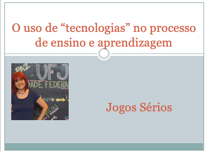

# O uso de "tecnologias" no processo de ensino e aprendizagem
## Tema aula - Jogos Sérios
 
>  * Apresentar reflexões sobre o termo jogos sérios.

## Atividades da aula - Definição de Jogos sérios, Diferença entre jogos, jogos sérios e gamificação, categorias de jogos sérios

### Materiais
- [Slides aula - Jogos Sérios](jogos_serios.pdf)

## Tecnologias aula prática
>  * Gamificação - Apresentação de tecnologias valendo pontuação gamificação

### Video aulas  -  Jogos Sérios - Teoria e Prática

### Desenvolvimento aula teórica: 

- [ ]  Jogos: Reflexão sobre jogos e seriedade
- [ ]  Diferença entre jogo, jogo sério e gamificação
- [ ]  Definição Jogos Sérios
- [ ]  Categorias de Jogos Sérios (Advergames- Publicidade em Jogos, Educativos, Jornalísticos, Militares)
- [ ]  Tempo para o desenvolvimento do Roteiro do Jogo

### Desenvolvimento aula  - prática: 
- [ ]  Desafio Tecnologia Inovadora - Em grupo
- [ ]  Desenvolvimento Roteiro do Jogo
