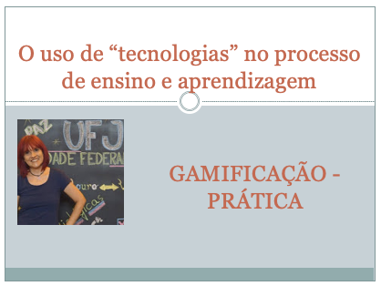

# O uso de "tecnologias" no processo de ensino e aprendizagem
## Tema aula - Gamificação
 
>  * Apresentar conceito sobre gamificação e refletir sobre os principais elementos necessários no processo de gamificação.

## Atividades da aula - Definição de Gamificação, Elementos, a importância da análise de perfil dos jogadores

### Materiais
- [Slides aula - Gamificação](gamificacao.pdf)

### Video aulas  -  Gamificação - Teoria e Prática

### Desenvolvimento aula teórica: 

- [ ] Definição Gamificação
- [ ] Vantagens dos jogos e seus benefícios
- [ ] Elementos PRINCIPAIS da gamificação: META,REGRAS,SISTEMA DE FEEDBACK,PARTICIPAÇÃO VOLUNTÁRIA.
- [ ] OUTROS elementos que são aplicados: STORYTELLING,AVATAR,DESAFIOS - CONQUISTAS - MISSÕES, RECOMPENSA, PONTUAÇÃO, MOEDAS-DINHEIRO VIRTUAL- LOJA VIRTUAL, MEDALHAS, PROGRESSÃO, FEEDBACK INSTANTÂNEO, COMPETIÇÃO, RANKING.
- [ ] Análise de pefil de jogadores e sua importância para um melhor planejamento da gamificação.
- [Um questionário para análise de perfil de jogador](http://livrogamification.com.br/quiz/)
- [ ] Perfis: Realizador, Explorador, Socializador, Predador.
- [ ] Gamificação em andamento: Kahoot GAMIFICAÇÃO

### Desenvolvimento aula  - prática: 
- [ ]  Desenvolvimento de atividades no Kahoot
- [ ]  Conforme sorteio compartilha atividade com a sala.
