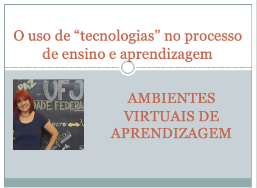

# O uso de "tecnologias" no processo de ensino e aprendizagem
## Tema aula - Ambientes Virtuais de Aprendizagem
 
>  * Apresentar conceito sobre histórico e principais conceitos sobre ambientes virtuais de aprendizagem e sua importância
>  
## Atividades da aula - Breve histórico, Definição de AVA, Benefícios, Funcionalidades, Modelos e Exemplos, Exemplos de plataformas e Atividade prática

### Materiais
- [Slides aula - Ambientes Virtuais de Aprendizagem](ambientes_virtuais_aprendizagem.pdf)

### Video aula  -  Ambientes Virtuais de Aprendizagem 

### Desenvolvimento aula teórica: 

- [ ] Educação à distância desde o final do século 19
- [ ] Evolução da infraestrutura para proporcionar a educação à distância
- [ ] Definição de Ambiente Virtual de Aprendizagem como um meio para permitir compartilhar e interagir, com foco no processo de ensino e aprendizagem
- [ ] Benefícios (superação do tempo e espaço,reforça o trabalho do professor, colaboração,potencializa a interatividade)
- [ ] Funcionalidades (gerência de usuários, gestão de conteúdos, comunicação...)
- [ ] Modelos e exemplos (linha do tempo, canvas, moodle, blackboard)
- [ ] Exemplos de plataformas: Moodle,Blackboard,Amadeus,Openredu, ClassCraft,Canvas)

### Desenvolvimento aula  - prática: 
- [ ]  Escolha o AVA: Canvas ou Classcraft - Crie um curso com pelo menos uma aula e com dois alunos.
Coloque a professora: anainocencio@ufj.edu.br, como aluna para que eu possa testar o curso.
