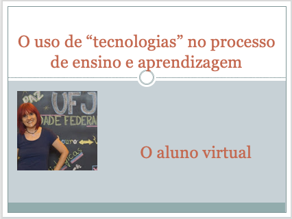

# O uso de "tecnologias" no processo de ensino e aprendizagem
## Tema aula - O Aluno Virtual
 
>  *Refletir sobre quem é este aluno virtual e os diferentes estilos de aprendizagem
>  
## Atividades da aula - Quem é o aluno virtual? O aluno virtual de sucesso; Os diferentes estilos de aprendizagem e as técnicas instrucionais para cada estilo; o que o aluno virtual precisa

### Materiais
- [Slides aula - O aluno virtual](o_aluno_virtual.pdf)

### Video aula  -  O Aluno Virtual)

### Desenvolvimento aula teórica: 

- [ ] A maioria dos alunos que estudam on-line são adultos, pois este tipo de aprendizagem permite uma continuidade no trabalho
- [ ] Sendo assim, é preciso entender este tipo de público, que aprecia um maior controle sobre o que está acontecendo
- [ ] AUTOMOTIVAÇÃO E AUTODISCIPLINA são essenciais para o aluno virtual
- [ ] Diferentes estilos de aprendizagem: visual-verbal, visual-não verbal ou visual-espacial,Auditivo-verbal ou verbal-linguístico, tátil-cinestésico ou corporal-cinestésico, lógico-matemático, interpessoal-relacional, intrapessoal-relacional
- [ ] Teste para verificar o estilo de aprendizagem: (https://www.makerzine.com.br/testes/teste-descubra-qual-e-o-seu-estilo-de-aprendizagem-segundo-o-modelo-felder-silverman/)
- [ ] O aluno virtual precisa se sentir parte do sistema, ou seja, precisa de todos os serviços que poderiam ser ofertados caso fosse presencial.

### Desenvolvimento aula  - prática: 
- [ ]  Ferramenta Quizizz - (https://quizizz.com/?lng=pt-BR)
