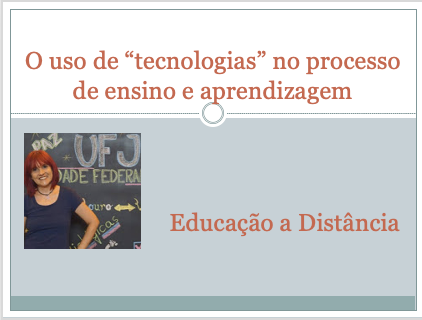

# O uso de "tecnologias" no processo de ensino e aprendizagem
## Tema aula - Educação a Distância
 
>  * Retomar os conteúdos já vistos, abordar os principais conceitos de educação a distância
>  
## Atividades da aula - Conceitos Básicos de educação a distância, Contexto histórico, A Importância da Interação

### Materiais
- [Slides aula - Educação a Distância](educacao_a_distancia.pdf)

### Video aula  -  Educação a Distância)

### Desenvolvimento aula teórica: 

- [ ] Recordar os temas abordados em nossas aulas e verificar se existe alguma dúvida sobre algum dos temas
- [ ] Apresentar os temas que serão vistos
- [ ] Idéia básica de educação à distância e conceitos principais
- [ ] Componentes de um sistema de EaD operacional
- [ ] Ensinar como VIAGEM AÉREA ATUAL X VIAGEM AÉREA ANTIGAMENTE
- [ ] O aluno no centro do sistema
- [ ] Criação de curso por equipe multidisciplinar
- [ ] O papel dos instrutores/tutores
- [ ] Linha do tempo da educação a distância
- [ ] Anna Eliot e a educação a distância em 1873
- [ ] Os tipos de interação: ALUNO - CONTEÚDO; ALUNO - INSTRUTOR/TUTOR; ALUNO - ALUNO

### Desenvolvimento aula  - prática: 
- [ ]  GENIALLY - utilizar o genially para criação de um conteúdo interativo.
