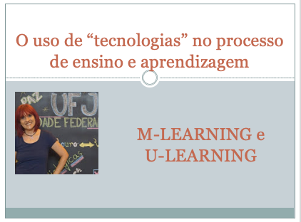

# O uso de "tecnologias" no processo de ensino e aprendizagem
## Tema aula - M-learning e U-learning
 
>  *Entender os principais conceitos relacionados a uma aprendizagem móvel e uma aprendizagem ubíqua, suas aplicações e vantagens.
>  
## Atividades da aula - Visão geral, conceitos básicos. Conteúdo extra: Aplicação e vantagens do M-learning e U-Learning

### Materiais
- [Slides aula - M-learning e U-learning](m_learning_e_u_learning.pdf)

### Video aula  -  M-learning e U-learning)

### Desenvolvimento aula teórica: 
- [ ] Diferenciar: e-learning, m-learning e u-learning
- [ ] Diferentes práticas relacionadas ao conceito de m-learning: e-learning portátil, aprendizagem em sala de aula apoiada por tecnologia, capacitação e treinamento móvel,inclusão e diversidade
- [ ] Definição de m-learning
- [ ] Mobilidade física, mobilidade tecnológica, mobilidade conceitual, mobilidade sociointeracional, mobilidade temporal
- [ ] U-learning (aprendizagem ubíqua) - conceito mais abrangente que o m-learning, originado a partir da noção de compubação ubíqua
- [ ] Computação ubíqua envolve a existência de diversos computadores interconectados por redes sem fio. Adicionalmente, a computação ubíqua inclui o uso de sensores que tornam os dispositivos computacionais "cientes" de cada usuários de forma "inteligente".
- [ ] Exemplo: tire uma foto e saiba o nome da planta.

### Desenvolvimento aula  - prática: 
- [ ]  Desenvolvimento do projeto: Sugestão:
- [ ]  RPG - (https://rpgplayground.com)
- [ ]  GameSalad: (https://gamesalad.com/)
- [ ]  Gdevelop: (https://gdevelop-app.com/)

